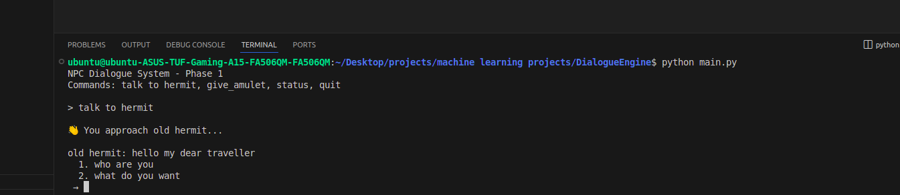
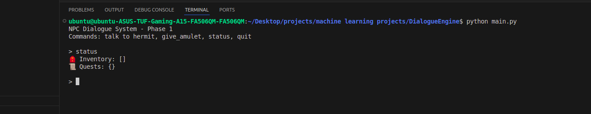
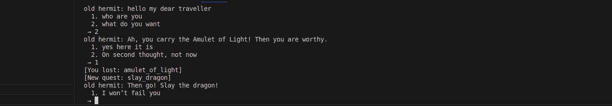
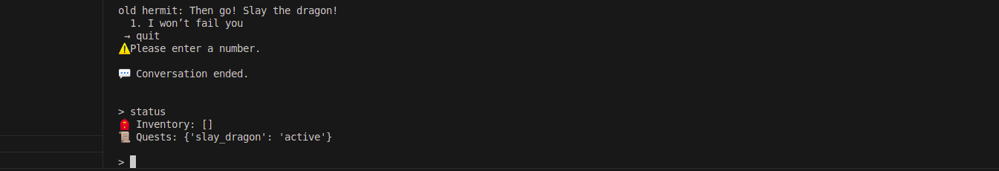

# DialogueEngine

A flexible, rule-based dialogue system for interactive fiction, RPGs, and text-based games built in Python. This engine provides a JSON-driven approach to creating complex conversational trees with conditional branching, item management, and quest systems.

## Project Overview

DialogueEngine is a lightweight, modular dialogue management system that allows developers to create interactive conversations with NPCs (Non-Player Characters). The system supports conditional dialogue branches, inventory management, quest tracking, and dynamic story progression through JSON configuration files.

## Run locally

```bash
git clone https://github.com/adheeb2/DialogueEngine.git
cd DialogueEngine

python main.py
```

## Quick demo

Here’s a snapshot of the hermit dialogue in action:



The project consist of four commands which is shown in this picture.

when the user types on 'talk to hermit', the conversation with the npc starts



Initially the player has neither objects in his inventory nor any quests.


So when we try to ask the 2nd option, we are met with a condition of not having the amulet of light


We then quit the convo and go back to gain the amulet by typing that command. As you can see, we will gain that object



Now with this, we move on with the convo and we will lose the amulet of light from the inventory and will gain a new quest as you see in this picture



This can be seen when we type on the status command

## Project Structure

```
DialogueEngine/
├── main.py                 # Entry point and command interface
├── dialogue_manager.py     # Core dialogue management logic
├── player.py              # Player state and inventory management
├── utils.py               # Utility functions for JSON parsing and actions
├── data/                  # Dialogue configuration files
│   └── hermit.json        # Sample NPC dialogue tree
├── README.md             # Project documentation
├── LICENSE               # MIT License
└── .gitignore           # Git ignore rules
```

## Personal goals

I’ve mapped out 15 projects across three themes:

1- Procedural NPC Dialogue → (rule-based → memory → world-aware)

2- Voice + Emotion AI → (speech, emotional states, real-time NPC reactions)

3- AI Agent Orchestration → (multi-agent debates, quest generators, self-improving NPCs, and eventually a full AI Game Master)

The hermit JSON you’re looking at right now is literally the first brick in a system that will grow into:

NPCs with personalities, memories, and backstories

Fully voiced, emotionally responsive conversations

An autonomous game master that can run entire worlds

This repo is me laying the foundation for that stack.
